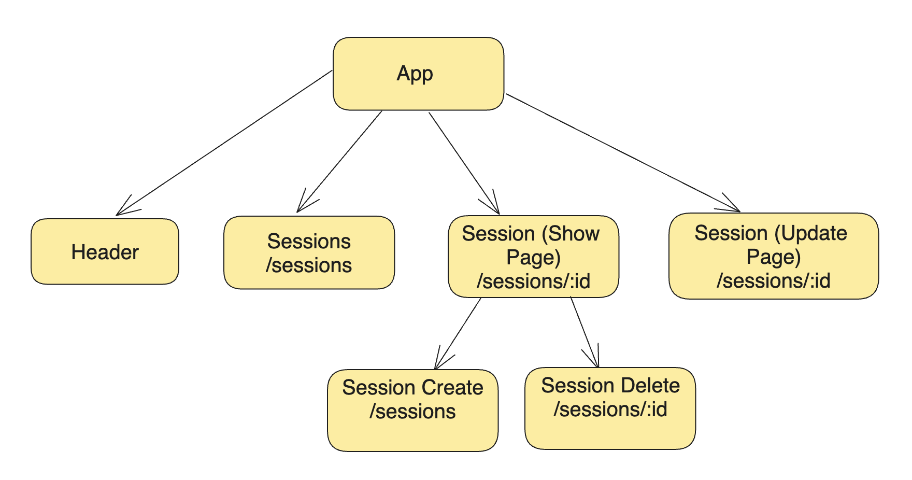
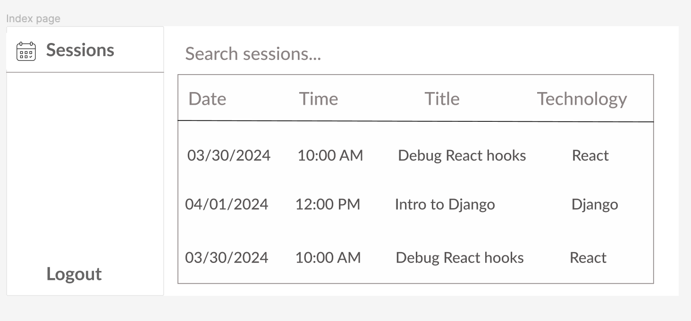
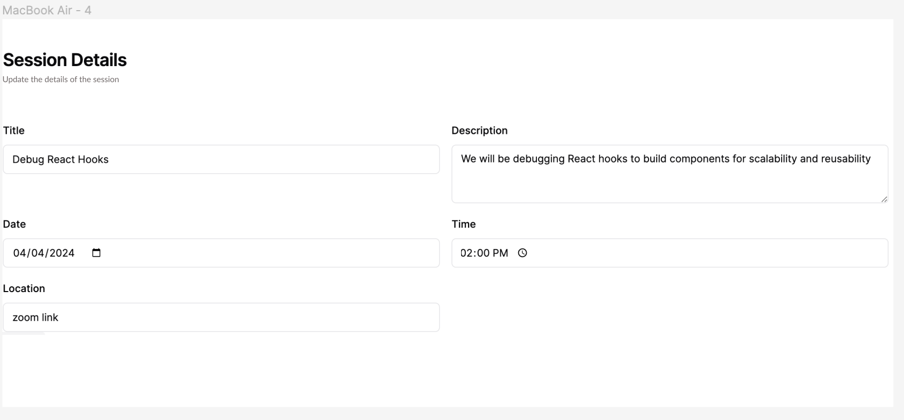
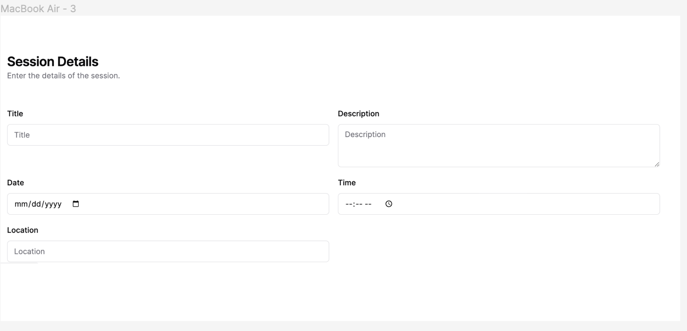

# Description

- **App Name:** CollabCoders
- **Description:** A Peer Programming Session Scheduler platform that facilitates the scheduling and management of pair programming sessions, which are crucial for collaborative coding, learning, and mentorship within the developer community.
- **Github URL:** https://github.com/amritadutta25/CollabCoders_frontend
- **Deployed Website:** 

# Problem Being Solved and Target Market
To create a platform where developers can schedule, join, and manage pair programming sessions, encouraging collaboration, knowledge sharing, and networking within the development community. This tool aims to simplify the process of finding pairing partners and organizing sessions around specific topics or projects.

## List of React Router Routes

| Route Name | Endpoint | Method | Description | 
|------------|----------|--------|-------------|
| Landing | / | GET | Renders all peer-programming sessions on a page|
| SessionShow | /sessions/:id | GET | Renders a session details|
| SessionCreate | /sessions/create | POST | Creates a perr programming session |
| SessionDelete | /sessions/delete/:id | DELETE | Deletes a session |
| SessionEdit | /sessions/:id | PUT | Updates a session details|

## React Architecture (Expected Tree of React Components)

## Mockups
Index page

Show page

Update showpage

Create page
